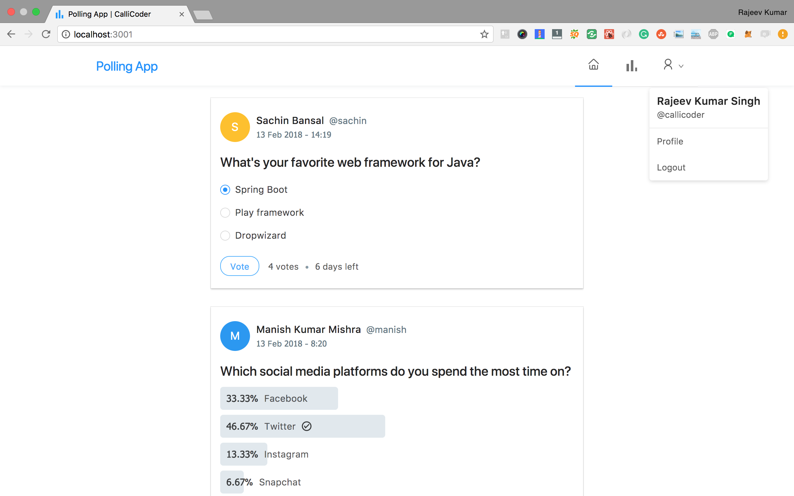

 ## 페이지빌더 서버 사이드 개발 목록
 
 - 사용자 등록 / 로그인 (사용자 삭제/수정 기능 필요)
 - 문서 저장 / 조회(모든 문서 조회, 사용자별 조회)
 
 ## 테스트 준비할 작업
 
 - 문서 수정 /삭제
 
 
## 아마존 설치 정보

- pagebuilder@clbee.com
- Zmfqlrnt5678  (클비굿5678)

- 폐기: ec2-15-164-213-54.ap-northeast-2.compute.amazonaws.com

- 2번 인스턴스: ec2-15-164-218-77.ap-northeast-2.compute.amazonaws.com

- user-name : ubuntu

### java8 설치

```linux
sudo apt-get update
sudo apt-get install openjdk-8-jdk
```

### mysql 설치

mysql 설치

1. root 계정으로 변경 변경
     $ sudo su
2. apt-get 패키지 업데이트
     $ apt-get update
3. MySQL 패키지 존재 유무 확인
     $ apt-cache search mysql-server
4. MySQL 5.7 설치
     $ apt-get install mysql-server-5.7
5. 외부접속 허용 설정
     $ vi /etc/mysql/mysql.conf.d/mysqld.cnf
     bind-address = 127.0.0.1을 0.0.0.0으로 변경
6. MySQL 서비스 재시작
     $ service mysql restart
7. MySQL 접속
     $ mysql -u root -p
     초기 password는 없으므로 'enter' key 입력
8. root계정의 비밀번호 생성 및 저장
     mysql > ALTER USER 'root'@'localhost' IDENTIFIED BY 'vpdlwlqlfejCms2014';
     mysql > commit;
10. 모든 ip에서 root 계정으로 접속 가능하게 설정
     mysql > GRANT ALL PRIVILEGES ON *.* TO 'root'@'%' IDENTIFIED BY 'vpdlwlqlfejCms2014';
     mysql > FLUSH PRIVILEGES;

11. schema - pageserver

## nginx 설치

- /var/www/html - chown -R ubuntu:ubuntu, chmod 775 /var/www/images
- images - CORS 설정
- layout, editor routing


## Building a Full Stack Polls app similar to twitter polls with Spring Boot, Spring Security, JWT, React and Ant Design



### Tutorials

I've written a complete tutorial series for this application on The CalliCoder Blog -

+ [Part 1: Bootstrapping the Project and creating the basic domain models and repositories](https://www.callicoder.com/spring-boot-spring-security-jwt-mysql-react-app-part-1/)

+ [Part 2: Configuring Spring Security along with JWT authentication and Building Rest APIs for Login and SignUp](https://www.callicoder.com/spring-boot-spring-security-jwt-mysql-react-app-part-2/)

+ [Part 3: Building Rest APIs for creating Polls, voting for a choice in a Poll, retrieving user profile etc](https://www.callicoder.com/spring-boot-spring-security-jwt-mysql-react-app-part-3/)

+ [Part 4: Building the front-end using React and Ant Design](https://www.callicoder.com/spring-boot-spring-security-jwt-mysql-react-app-part-4/)

## Steps to Setup the Spring Boot Back end app (polling-app-server)

1. **Clone the application**

	```bash
	git clone https://github.com/callicoder/spring-security-react-ant-design-polls-app.git
	cd polling-app-server
	```

2. **Create MySQL database**

	```bash
	create database polling_app
	```

3. **Change MySQL username and password as per your MySQL installation**

	+ open `src/main/resources/application.properties` file.

	+ change `spring.datasource.username` and `spring.datasource.password` properties as per your mysql installation

4. **Run the app**

	You can run the spring boot app by typing the following command -

	```bash
	mvn spring-boot:run
	```

	The server will start on port 8080.

	You can also package the application in the form of a `jar` file and then run it like so -

	```bash
	mvn package
	java -jar target/polls-0.0.1-SNAPSHOT.jar
	```
5. **Default Roles**
	
	The spring boot app uses role based authorization powered by spring security. To add the default roles in the database, I have added the following sql queries in `src/main/resources/data.sql` file. Spring boot will automatically execute this script on startup -

	```sql
	INSERT IGNORE INTO roles(name) VALUES('ROLE_USER');
	INSERT IGNORE INTO roles(name) VALUES('ROLE_ADMIN');
	```

	Any new user who signs up to the app is assigned the `ROLE_USER` by default.

## Steps to Setup the React Front end app (polling-app-client)

First go to the `polling-app-client` folder -

```bash
cd polling-app-client
```

Then type the following command to install the dependencies and start the application -

```bash
npm install && npm start
```

The front-end server will start on port `3000`.
